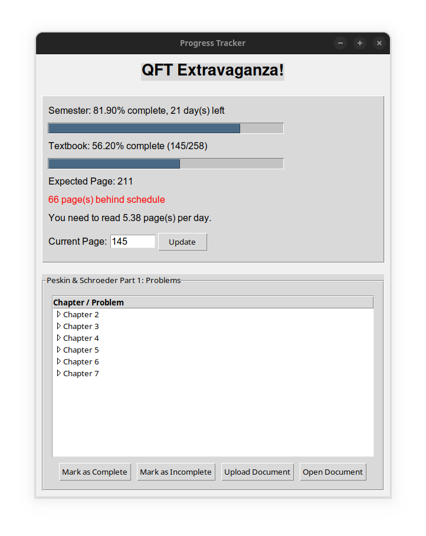

# QFT Progress Tracker

A Tkinter-based application for tracking progress through Peskin & Schroeder's "Quantum Field Theory" textbook.



## Features

- **Semester Progress Tracking**: Visual display of elapsed time and remaining days in the semester
- **Textbook Progress**: Track your current page and compare it with expected progress
- **Problem Completion**: Mark problems as complete or incomplete
- **Document Management**: Upload and open solution documents for each problem
- **Status Indicators**: Color-coded feedback on whether you're ahead or behind schedule

## Installation

1. Clone this repository:
   ```
   git clone https://github.com/yourusername/qft-progress-tracker.git
   cd qft-progress-tracker
   ```

2. Run the application:
   ```
   python progress_tracker.py
   ```

## Configuration

You can modify the following parameters at the top of the script:

- `SEMESTER_START`: Start date of your semester/course
- `SEMESTER_END`: End date of your semester/course
- `TOTAL_PAGES`: Total number of pages in the textbook
- `INITIAL_PAGE`: Your current page when starting the tracker

## Usage

### Tracking Reading Progress

1. Enter your current page in the "Current Page" field
2. Click "Update" to save your progress
3. View your progress compared to the expected pace

### Managing Problems

1. Navigate through the chapter tree to find problems
2. Select a problem and click "Mark as Complete" when finished
3. Upload your solution document (optional)
4. Open the document later for review

## Data Storage

The application stores your progress locally:

- `completed_problems.json`: Records which problems you've completed
- `uploaded_documents/`: Directory containing copies of your uploaded solution files

## Requirements

- Python 3.6+
- Tkinter (included in standard Python installations)

## License

This project is licensed under the MIT License - see the [LICENSE](LICENSE) file for details.

## Contributing

Contributions are welcome! Please feel free to submit a Pull Request.

## Acknowledgments

- Peskin & Schroeder for their excellent QFT textbook
- All physics students struggling through QFT problems
