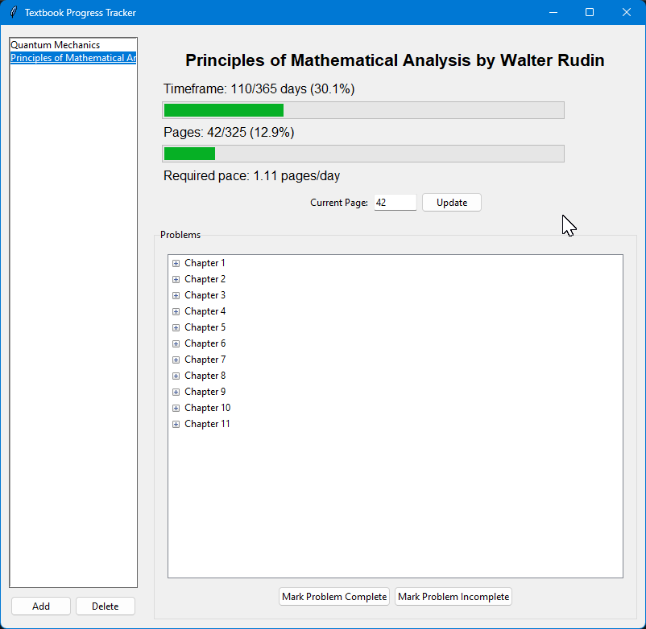
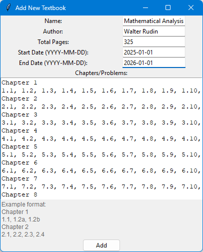

# Textbook Progress Tracker (TPT)

         _            _        _       
        /\ \         /\ \     /\ \     
        \_\ \       /  \ \    \_\ \    
        /\__ \     / /\ \ \   /\__ \   
       / /_ \ \   / / /\ \_\ / /_ \ \  
      / / /\ \ \ / / /_/ / // / /\ \ \ 
     / / /  \/_// / /__\/ // / /  \/_/ 
    / / /      / / /_____// / /        
   / / /      / / /      / / /         
  /_/ /      / / /      /_/ /          
  \_\/       \/_/       \_\/           


A Tkinter-based application for tracking progress through textbooks for academics or personal use



## Features
- **Multiple textbooks**: Keep track of multiple textbooks, all saved locally
- **Progress Tracking**: Visual display of elapsed time and remaining days in the semester or your personal deadline
- **Textbook Progress**: Track your current page and compare it with expected progress
- **Problem Completion**: Mark problems as complete or incomplete
- **Status Indicators**: Color-coded feedback on whether you're ahead or behind schedule

## Usage

2. Run the application:
   ```
   python progress_tracker.py
   ```

## Usage


### Add a new textbook



1. Enter in the books title, author, and page count information
2. Consider your starting date and what date you'd like to be finished
3. Copy the chapter problems, following the example format


### Tracking Reading Progress

1. Enter your current page in the "Current Page" field
2. Click "Update" to save your progress
3. View your progress compared to the expected pace

### Managing Problems

1. Navigate through the chapter tree to find problems
2. Select a problem and click "Mark as Complete" when finished
3. Open the document later for review

## Data Storage

The application stores your progress locally:

- `textbooks.json`

## Requirements

- Python 3.6+
- Tkinter (included in standard Python installations)

## License

This project is licensed under the MIT License - see the [LICENSE](LICENSE) file for details.

## Contributing

Contributions are welcome! Please feel free to submit a Pull Request.

## Acknowledgments

- tank321 for his excellent code and hard work through Peskin and Schroeter's QFT
- All students struggling through difficult textbooks
